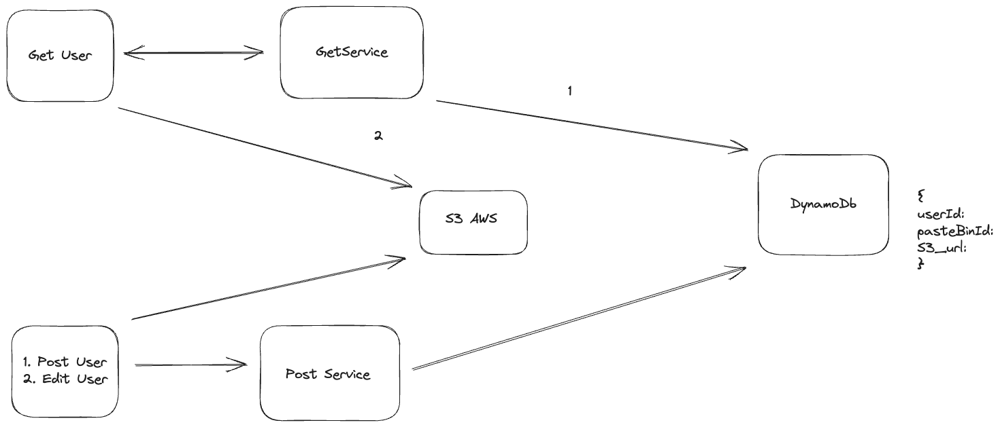

# Paste-Bin
This Repository is implementing PasteBin in spring boot application

Paste Bin System Overview



PasteBin Spring Boot Service APIs


Get Apis:
1. ```/{pasteBinId}```
   Request:
   NULL
   Response:
```
   {
      file_name:
      pasteBin_id:
      pasteBin_S3_url:
   }
```

2. ```/{UserId}```
   Request:
     NULL
   Response:
```
   [
      {
         file_name:
         pasteBin_id:
         pasteBin_S3_url:
      },
      {
         file_name:
         pasteBin_id:
         pasteBin_S3_url:
      },
   ]
```

Register APIs
1. ```/register```
   Request Body:
   ```
   {
      userId:    (not Required)
      file_name: (not Required)
   }
   ```
   Response:
   ```
   {
      pasteBin_id:
      pasteBin_S3_url:
   }
   ```

Update APIs
1. ```/Update```
   Request Body:
   ```
   {
      userId:    (not Required)
      file_name: (not Required)
      PasteBinId: (Required)
   }
   ```
   Response:
   ```
   {
      pasteBin_id:
      pasteBin_S3_url:
   }
   ```

Other APIs
1.  ```/confirm```
    Request Body:
    ```
    {
       userId:    (not Required)
       PasteBinId: (Required)
    }
    ```
    Response:
    ```
    {
      pasteBin_id:
      pasteBin_S3_url:
    }
    ```

Delete APIs
1. ```/Delete```
   Request Body:
   ```
   {
      userId:    (not Required)
      file_name: (not Required)
      PasteBinId: (Required)
   }
   ```
   Response:
    ```
    NULL
    ```
   Note: /Delete end point should be soft delete (Need to store userId for some time in different S3)


# PasteBinServiceCDK
To deploy changes using CDK, please follow the below steps. 
1. Create an AWS Profile in your local using AWS CLI.
   * `aws configure --profile <profile-name>`
2. Verify AWS CLI Configuration
   * `aws configure list --profile <profile-name>`
3. Prepare your AWS environment for deploying CDK applications
   * `cdk boostrap` - sets up the necessary resources and permissions to enable CDK deployments to function properly.
4. Deploy the created or modified resources in CDK
   * `AWS_PROFILE=<profile-name> cdk deploy`